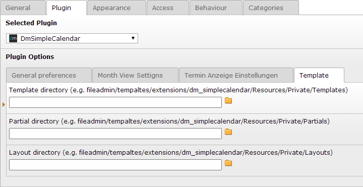

.. ==================================================
.. FOR YOUR INFORMATION
.. --------------------------------------------------
.. -*- coding: utf-8 -*- with BOM.

.. include:: ../Includes.txt

.. _configuration:

Configuration Reference
=======================

.. _configuration-typoscript:

HowTo: Outsource the templates – use your own templates
-------------------------------------------------------

If you want to modify the templates and keep these changes after an extension update, die can outsource the template folders.

**Duplicate the folders**

- `EXT:dm_simplecalendar/Resources/Private/Layouts`

- `EXT:dm_simplecalendar/Resources/Private/Partials`

- `EXT:dm_simplecalendar/Resources/Private/Templates`

**into the fileadmin**

- `fileadmin/templates/extensions/dm_simplecalendar/Resources/Private/Layouts`

- `fileadmin/templates/extensions/dm_simplecalendar/Resources/Private/Partials`

- `fileadmin/templates/extensions/dm_simplecalendar/Resources/Private/Templates`

The following TypoScript configuration tells the extension to use your new destination:

.. code-block:: typoscript

	plugin.tx_dmcalendar.view {
		templateRootPath = fileadmin/templates/html/extensions/dm_simplecalendar/Resources/Private/Templates/
		partialRootPath = fileadmin/templates/html/extensions/dm_simplecalendar/Resources/Private/Partials/
		layoutRootPath = fileadmin/templates/html/extensions/dm_simplecalendar/Resources/Private/Layouts/
	}

**You can set this configuration globaly or for each page, as TS constant or setup or in every each dm_simplecalendar plugin:**

HowTo: Overwrite localisation via TypoScript
--------------------------------------------

Write the following in your TypoScript Setup

.. code-block:: typoscript

	plugin.tx_dmsimplecalendar._LOCAL_LANG.de {
	    date.cw = Kalenderwoche
	    calendar.month.noAppointments = 
	    calendar.day.noAppointments = Keine Termine
	    tx_dmsimplecalendar_view_date_currentmonth = Aktueller Monat
	}

Default included label-keys
^^^^^^^^^^^^^^^^^^^^^^^^^^^

.. container:: locallang-labelKeys

	====================== ================================== ====================
	Cat / Type             label-key                             Default
	====================== ================================== ====================
	General
	.                      :code:`general.back`                  zurück
	.                      :code:`general.Back`                  Zurück
	.                      :code:`general.backToCalendar`        zurück zum Kalender
	.                      :code:`general.edit`                  bearbeiten
	.                      :code:`general.delete`                löschen
	.                      :code:`general.legend`                Legende
	Dates
	.                      :code:`date.month.January`            Januar
	.                      :code:`date.month.February`           Februar
	.                      :code:`date.month.March`              März
	.                      :code:`date.calendarWeek`             Kalenderwoche
	.                      :code:`date.cw`                       KW
	.                      :code:`date.today`                    Heute
	More
	.                      :code:`bla.foo`                       bar
	====================== ================================== ====================

.. _configuration-faq:

FAQ
---

Please use the `typo3 forge bug tracker <http://forge.typo3.org/projects/extension-dm_simplecalendar/issues>`_ or send an email to <salvatore.eckel@diemedialen.de> if you have a question what should be listet here.
