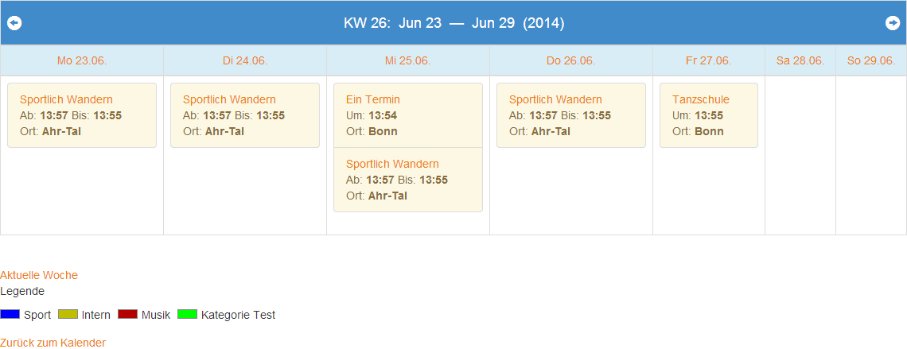
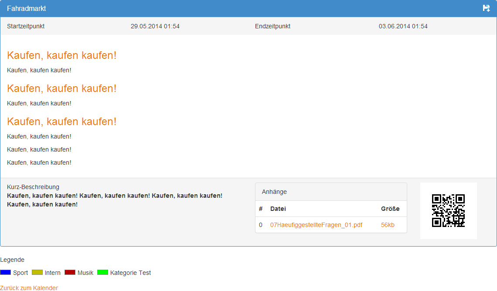
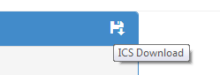

.. ==================================================
.. FOR YOUR INFORMATION
.. --------------------------------------------------
.. -*- coding: utf-8 -*- with BOM.

.. include:: ../Includes.txt

.. _introduction:

Introduction
============

.. _what-it-does:

What does it do?
----------------

With this extension you can create appointments and display them in a calendar view.

The calendar provides year/month/week views. - (day will be added soon)

You can create different calendar plugins which show different categories for appointments or you can create one plugin which displays appointments from many categories.

You can highlight different categories with a color system.

You can download an ICS file for each appointment to share your appointments.

You can display QR Codes for your appointments.

.. _screenshots:

Screenshots
-----------

The screenshots show, what you can exprect the extension will deliver.

- Display appointments in calendar
- Display or hide 'back to calendar' link
- Display or hide category legend and color
- Navigate to prev or next year/month/week - (day will be added soon)
- Navigate through different views (year,month,week) - (day will be added soon)

This is the month view with a bootstrap template
**************************************

.. figure:: ../Images/Introduction/ViewMonthBootstrap.png
   :alt: Month View - Bootstrap Template

This is the week view with a bootstrap template
**************************************

This is the appointment detail view with a bootstrap template
**************************************

- Show or hide QR Code (different url-shortener-services included in plugin)
- List attached files

--------------------------

- Show or hide ICS Download Icon

